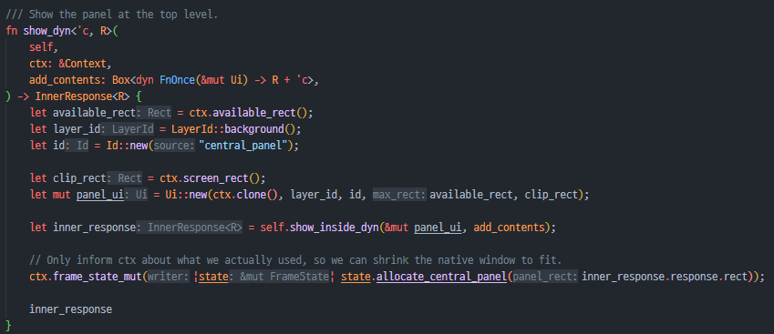

# Hello World

## 설정과 실행

egui 리포의 examples 폴더의 hello world 예제를 main.rs로 복사합니다.&#x20;

cargo build로 확인 합니다.&#x20;

```rust
error[E0433]: failed to resolve: use of undeclared crate or module `env_logger`
 --> src\main.rs:6:5
  |
6 |     env_logger::init(); // Log to stderr (if you run with `RUST_LOG=debug`).
  |     ^^^^^^^^^^ use of undeclared crate or module `env_logger`

```

```toml
log = "0.4.0"
env_logger = "0.9.0"
```

위 항목을 추가합니다. crates.io의 env\_logger 문서에서 확인했습니다.&#x20;

문서와 달리 env\_logger는 0.10.0을 사용해야 한다고 Cargo.toml 파일에 오류가 표시되어 수정해서 빌드합니다.&#x20;

<figure><figcaption><p>실행 화면</p></figcaption></figure>

이제 빌드와 실행이 잘 됩니다. 한글 폰트가 아니라 한글 입력과 출력은 안 됩니다.&#x20;

## 코드 분석

```rust
use eframe::egui;
use env_logger;
```

* 필요한 모듈들을 use 합니다.&#x20;


```rust
fn main() -> Result<(), eframe::Error> {
    env_logger::init(); // Log to stderr (if you run with `RUST_LOG=debug`).

    let options = eframe::NativeOptions {
        initial_window_size: Some(egui::vec2(320.0, 240.0)),
        ..Default::default()
    };

    eframe::run_native(
        "My egui App",
        options,
        Box::new(|_cc| Box::<MyApp>::default()),
    )
}
```


* 로거를 라인 2에서 초기화 합니다.&#x20;
* 윈도우 크기 등 옵션을 라인 4\~7에서 지정합니다.&#x20;
* `MyApp`을 `Box` 안에 만들어 `run_native()`로 실행합니다.
* 라인 12의 Box::\<MyApp>::default()는 아래 Box의 default를 통해 MyApp의 default를 호출하여 생성합니다.

```rust
impl<T: Default> Default for Box<T> {
    /// Creates a `Box<T>`, with the `Default` value for T.
    fn default() -> Self {
        #[rustc_box]
        Box::new(T::default())
    }
}
```

* 라인 12의 Box::new(|\_cc| ...) 부분은 appCreator 클로저로 전달합니다.&#x20;
* 여러 실행 경로가 있지만 결국 GlowWinitApp::init\_run\_state()에서 사용합니다.


```rust
  let app_creator = std::mem::take(&mut self.app_creator)
        .expect("Single-use AppCreator has unexpectedly already been taken");
    let mut app = app_creator(&epi::CreationContext {
        egui_ctx: integration.egui_ctx.clone(),
        integration_info: integration.frame.info(),
        storage: integration.frame.storage(),
        gl: Some(gl.clone()),
        #[cfg(feature = "wgpu")]
        wgpu_render_state: None,
    });
```


`std::mem::take()` 함수는 아래와 같이 기존의 값을 가져오고 기존 값은 default로 만듭니다.

> Replaces `dest` with the default value of `T`, returning the previous `dest` value.
>
> * If you want to replace the values of two variables, see [`swap`](https://doc.rust-lang.org/std/mem/fn.swap.html).
> * If you want to replace with a passed value instead of the default value, see [`replace`](https://doc.rust-lang.org/std/mem/fn.replace.html).

클로저를 `Box`에 넣어서 전달하고 가져와서 호출하는 예입니다. `app_creator()` 함수 호출이 `Box<Fn?>`의 함수 호출로 됩니다. (확인이 필요)

```rust
impl eframe::App for MyApp {
    fn update(&mut self, ctx: &egui::Context, _frame: &mut eframe::Frame) {
        egui::CentralPanel::default().show(ctx, |ui| {
            ui.heading("My egui Application");
            ui.horizontal(|ui| {
                let name_label = ui.label("Your name: ");
                ui.text_edit_singleline(&mut self.name)
                    .labelled_by(name_label.id);
            });
            ui.add(egui::Slider::new(&mut self.age, 0..=120).text("age"));
            if ui.button("Click each year").clicked() {
                self.age += 1;
            }
            ui.label(format!("Hello '{}', age {}", self.name, self.age));
        });
    }
}
```

* 가장 중요한 `MyApp::update( )` 함수입니다.
*   |ui| 로 시작하는 클로저들은 아래와 같은 함수 입니다. `FnOnce`도 트레이트입니다.

    ```rust
            add_contents: impl FnOnce(&mut Ui) -> R,
    ```

이와 같은 기법들은 실제 코드에서 확인 가능한 것들 입니다. 그 외에 설계에서도 배울 수 있겠으나 "안녕, 세계야" 예에서는 이 정도로 하겠습니다.

<details>

<summary>놀미 노트</summary>

놀라운 점은 C++ 코드는 아직도 머리 속에 잘 들어오지 않는 코드가 많은데 egui 코드 대부분 이해가능하다는 점입니다. 모르는 것들도 보면 이해할 수 있으리라는 확신이 듭니다.&#x20;

C 코드를 볼 때 코드가 복잡하면 언어 때문이 아니라 기능이나 상태가 복잡하기 때문이라 코드 구조를 이해해야 한다라는 생각이 드는 것과 매우 비슷합니다.

이는 좋은 일입니다.

아래에서 T와 E는 무엇이고 어떻게 알 수 있습니까?

```cpp
template <typename T, typename E, typename = void, typename = void>
struct associated_executor_impl
{
  typedef void asio_associated_executor_is_unspecialised;

  typedef E type;

  static type get(const T&) ASIO_NOEXCEPT
  {
    return type();
  }

  static const type& get(const T&, const E& e) ASIO_NOEXCEPT
  {
    return e;
  }
};
```

**C++의 시대는 끝내야 합니다.**

</details>

러스트는 이만큼의 코드에서 타잎을 모르는 변수나 함수나 제네릭 파라미터는 없습니다.

<figure><figcaption><p>show_dyn&#x3C;'c,R> generic 함수</p></figcaption></figure>

* R의 타잎은 어떻게 알 수 있을까요? 타잎을 알 수 있는 지점은 FnOnce의 리턴값으로만 가능합니다. 이는 호출하는 쪽에서 봐야 합니다. 대부분 () 을 리턴하므로 아마도 거의 그럴 듯 합니다.
* 이와 같이 러스트는 타잎을 알 수 있습니다. R은 임의의 타잎이 될 수 있는 경우입니다.
* egui의 [frame 코드](https://github.com/emilk/egui/blob/master/crates/egui/src/containers/frame.rs)를 읽을 때 막히는 부분이 없습니다.
